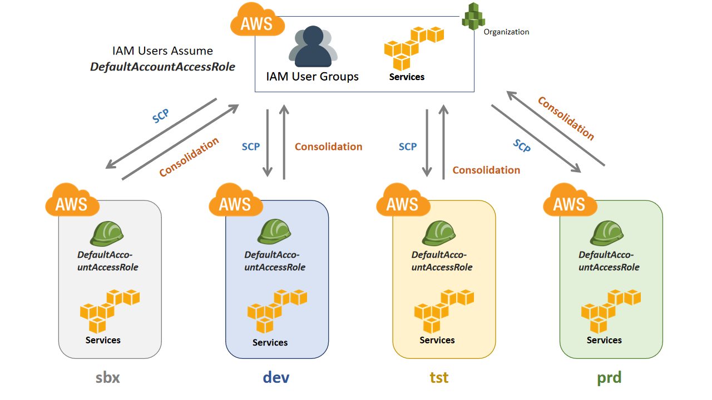

**************
Infrastructure
**************

What is the problem ?
#####################

What could go wrong with monolithic infrastructure for development ?

* All deployments in one account could lead to tragic situations in maintenance.
* Not every role in an organization need same level of access.
* There should be a clear separation between development and test environments for proper quality assurance. 

Architecture
############

Codetaut hosted its services in `AWS (Amazon Web Services) <https://aws.amazon.com>`_ spread across regions.
The organization is based on multi account architecture. Codetaut group spread out its environments into 4 independent accounts
namely as below

* sbx (Sandbox)
* dev (Development)
* tst (Test)
* prd (Production)

    
    Figure (1) : Codetaut organization architecture

* There is only one parent organization with account name ``codetautgroup`` (might be referred as ``codetaut`` as well)
* All users and user groups are created in ``codetautgroup`` IAM service.
* All the above listed accounts namely ``sbx``, ``dev``, ``tst``, ``prd`` are created under this organizational unit.
* Service control policies (SCPs) are created under ``codetautgroup``, to give each account with list of allowed services.
* User groups in organizational unit are assigned to service roles (that are created in individual accounts) 
  that a user can assume to get access to the corresponding account.
